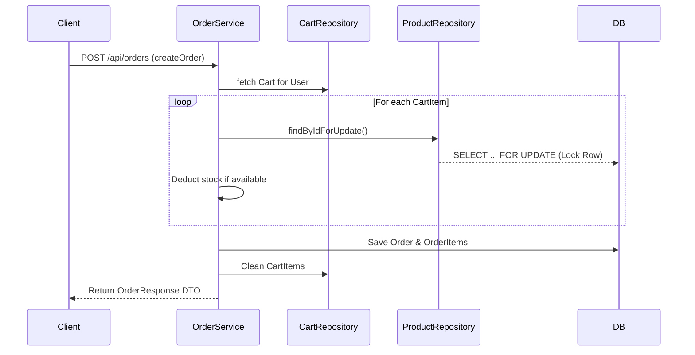
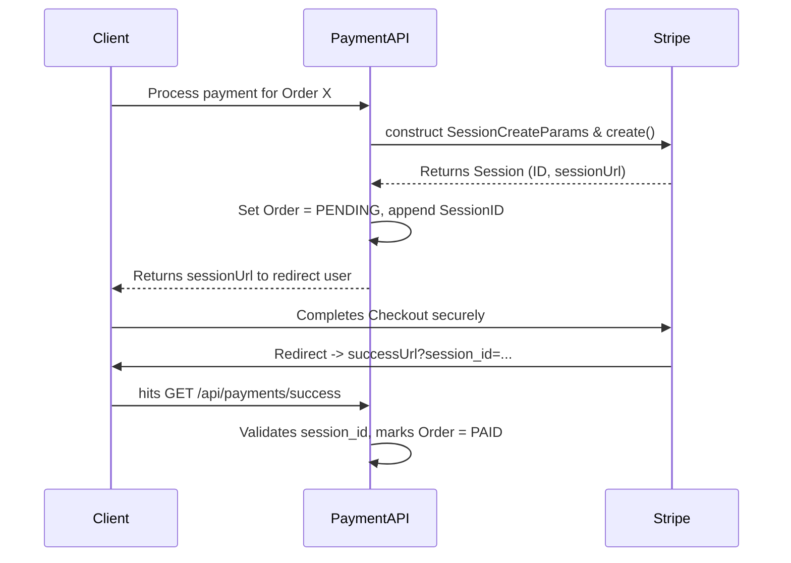

# Comprehensive E-Commerce Backend Interview Guide

This guide is designed to thoroughly prepare you for a technical interview based on your e-commerce system backend. Review these questions, concepts, and code snippets, as they represent the most common and challenging topics an interviewer might ask when evaluating your project.

---

## 🏗️ Architecture & Business Logic

### Q1. How do you handle concurrency when multiple users try to purchase the same product simultaneously?
**Answer:**
Concurrency is handled using **Pessimistic Locking** at the database level. In high-traffic e-commerce platforms, race conditions can cause stock overselling (e.g., two users buy the last remaining item at the exact same millisecond). 
To prevent this, the product is queried during the checkout process using the `@Lock(LockModeType.PESSIMISTIC_WRITE)` annotation. This guarantees that MySQL places an exclusive lock on the row, forcing other concurrent transactions to wait until the current transaction either commits (reducing stock) or rolls back.

**Code Snippet (`ProductRepository.java`):**
```java
public interface ProductRepository extends JpaRepository<Product, Long> {
    @Lock(LockModeType.PESSIMISTIC_WRITE)
    @Query("SELECT p FROM Product p WHERE p.id = :id")
    Optional<Product> findByIdForUpdate(@Param("id") Long id);
}
```

### Q2. Can you explain the exact flow of how an order is generated from a user's cart?
**Answer:**
The order flow executes within a single database transaction (`@Transactional`) to guarantee ATOMIC operations.
1. The currently authenticated user's cart is safely retrieved using their JWT context.
2. The service verifies the cart is not empty.
3. For each item in the cart, the system securely locks the specific `Product` row in the database using `findByIdForUpdate()`.
4. It checks stock availability; if stock $< 0$ after deduction, it throws an exception (which rolls back the whole transaction).
5. `OrderItem` entities are created mapping the product and saving the *snapshot* price (protecting the order history from future price changes).
6. The total cost is summed, the `Order` entity is saved, and the `Cart` items are wiped clean.

**Visual Flow (Order Creation):**


### Q3. Why do you use DTOs (Data Transfer Objects) instead of returning Entities directly?
**Answer:**
Returning Entities directly exposes the internal database schema and can lead to over-posting or leaking sensitive data (like `password` in `User`). 
By using classes like `OrderResponse` or `PaymentRequest`, the application defines a strict API contract. Mappers isolate changes: if the database schema (`Entity`) changes, the API JSON output (`DTO`) doesn't necessarily have to break, providing robust backward compatibility.

---

## 🔒 Security & Authentication

### Q4. How does Spring Security work alongside JWT in your application?
**Answer:**
The app leverages a stateless security design perfect for REST APIs. 
- A custom `JwtAuthenticationFilter` (executed before Spring's `UsernamePasswordAuthenticationFilter`) intercepts every HTTP request.
- It parses the `Authorization: Bearer <token>` header, extracts the email and roles via `JwtUtil`, and sets a `UsernamePasswordAuthenticationToken` in the `SecurityContext`.
- Using `SecurityFilterChain`, public routes (like `/api/auth/login`) are bypassed, while specific functional routes enforce authorization levels (e.g., `.requestMatchers("/api/products/**").hasRole("ADMIN")`).

### Q5. How do you guarantee your JWT Secret Key is present and secure when the application boots?
**Answer:**
We use a `@PostConstruct` lifecycle hook in `JwtUtil.java`. When the Spring Context initializes the `JwtUtil` singleton bean, this method guarantees that:
1. The secret key is provided (usually via Environment variables like `${JWT_SECRET}`).
2. The secret key meets the minimum security threshold (32 characters for `HS256`).
If these conditions aren't met, the app predictably crashes via `IllegalStateException`, preventing the backend from deploying in a compromised or insecure state.

**Code Snippet (`JwtUtil.java`):**
```java
@PostConstruct
public void init() {
    if (secret == null || secret.isBlank()) {
        throw new IllegalStateException("JWT secret is not configured");
    }
    if (secret.length() < 32) {
        throw new IllegalStateException("JWT secret must be at least 32 characters");
    }
    signingKey = Keys.hmacShaKeyFor(secret.getBytes(StandardCharsets.UTF_8));
}
```

---

## 💸 Third-Party Integrations

### Q6. Walk me through the Stripe Payment processing flow.
**Answer:**
The backend handles Stripe integration cleanly by generating securely tracked checkout sessions.
1. The user requests to pay for `orderId`.
2. `PaymentService` queries the database and verifies two rules: Does the user *own* this order, and is the order strictly *unpaid*?
3. Using the `stripe-java` SDK, we build `SessionCreateParams`, configuring prices (in paisa/cents), names, and success/cancel callback URLs.
4. Stripe returns a session object. Our backend saves the `sessionId` to the `Order` table and updates the status to `PENDING`.
5. The `sessionUrl` is sent back to the frontend to redirect the user to Stripe's secure UI.
6. Once completed, Stripe redirects back to our `successUrl`, triggering `handlePaymentSuccess()` which flips the order to `PAID`.

**Visual Flow (Payment Process):**


---

## 📊 Error Handling & Data Integrity

### Q7. How do you implement global, standardized error handling?
**Answer:**
By heavily utilizing `@RestControllerAdvice`. Instead of scattering `try-catch` blocks throughout controllers, `GlobalExceptionHandler` intelligently catches thrown custom exceptions—like `ResourceNotFoundException`, `UnauthorizedException`—and translates them into a uniform JSON response structure (containing `timestamp`, `status`, and `message`). 
Additionally, it traps Spring's built-in `MethodArgumentNotValidException` to intercept Validation failures (like `@NotBlank`), wrapping the specific field errors into a neat JSON map.

**Code Snippet (`GlobalExceptionHandler.java`):**
```java
@ExceptionHandler(MethodArgumentNotValidException.class)
public ResponseEntity<Map<String, Object>> handleValidation(MethodArgumentNotValidException ex) {
    Map<String, Object> response = new HashMap<>();
    Map<String, String> errors = new HashMap<>();

    ex.getBindingResult().getFieldErrors().forEach(error ->
        errors.put(error.getField(), error.getDefaultMessage())
    );

    response.put("error", "Validation Failed");
    response.put("messages", errors);
    return ResponseEntity.badRequest().body(response);
}
```

### Q8. What is the relation mapping between a User and their Cart? How does JPA manage it?
**Answer:**
A `User` has a one-to-one relationship with a `Cart`. We manage this using `@OneToOne(mappedBy = "user", cascade = CascadeType.ALL)` on the `User` entity. 
- `mappedBy = "user"` informs JPA that the `Cart` entity actually owns the foreign key in the database table.
- `cascade = CascadeType.ALL` ensures that if a User is created, updated, or permanently deleted, those database operations automatically safely cascade down to their corresponding Cart without manual repository calls.

### Q9. Since your Spring Boot config specifies `spring.jpa.hibernate.ddl-auto=update`, is this safe for production?
**Answer:**
In a local or development environment, `update` is incredibly efficient because JPA automatically compares our Object Entities and mutates tables directly. **However, in a production environment, this is highly discouraged.** Instead, `ddl-auto` should be set to `validate` or `none`, and schema migrations should be cleanly managed by a versioning tool like **Flyway** or **Liquibase** to ensure zero data-loss and safe rollbacks.

### Q10. Look at `spring.datasource.url=${DB_URL:jdbc:mysql://localhost:3306/ecommerce}`. Why use `${}` syntax?
**Answer:**
This is Spring's property placeholder syntax. It tells the application to look into the deployment environment (e.g., Docker ENV variables, OS variables) for the `DB_URL` key first. If it cannot find it, it gracefully defaults to `jdbc:mysql://localhost:3306/ecommerce`. This guarantees our application code remains immutable between local development laptops and production cloud servers—fulfilling the 12-Factor App methodology concerning configuration.
